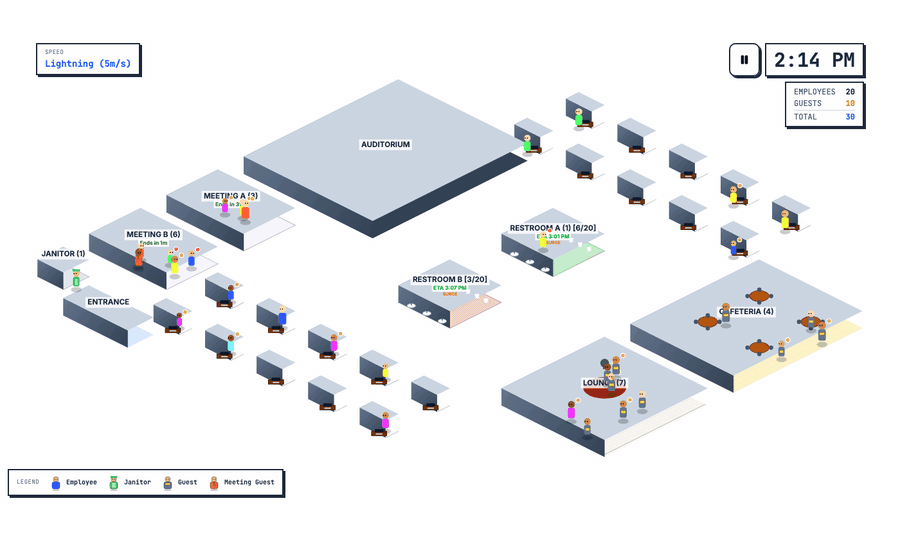

# Mapped Restroom Sim

[](https://github.com/mapped/sim-restroom/actions/workflows/ci.yml)
[](LICENSE)
[](https://nodejs.org)

> **TL;DR** — An interactive browser simulator that demonstrates **conditions-based restroom maintenance**: sensor-driven work orders dispatched by a predictive model, versus the traditional fixed-schedule approach. Open it in a tab, watch a full workday run, toggle Predictive ↔ Scheduled mode live. Built by [Mapped](https://mapped.com) to show what a neutral data-infrastructure layer unlocks.

An interactive isometric simulator that demonstrates **conditions-based restroom maintenance (CBM)** — built by [Mapped](https://mapped.com) to show how normalized sensor data, consumer AI, and CMMS automation can replace fixed cleaning schedules in real facilities.

Open `npm run dev` and you'll watch a small office run a full day: people arrive, hold meetings, visit restrooms, and an on-screen CMMS issues work orders that dispatch a janitor — reactively in scheduled mode, or _ahead of predicted surges_ in predictive mode.



---

## Why we built this

In large enterprise facilities — corporate campuses, airports, universities — the default custodial model is still time-based: porters sweep fixed rounds regardless of whether the restroom has seen zero occupants or three hundred. The research paper in [`docs/Conditions-Based Restroom Maintenance.md`](docs/Conditions-Based%20Restroom%20Maintenance.md) walks through why that's broken:

- **Dual failure of resource allocation**: schedules simultaneously over-service empty restrooms and under-service post-event surges. A pristine facility can degrade within minutes of a 300-person lecture letting out.
- **Hybrid work makes it worse**: a HQ that used to see uniform Monday–Friday load now sees 80% occupancy Tuesday/Wednesday and 15% Friday. The schedule doesn't flex; the labor bill doesn't either.
- **The reputational stakes are real**: industry data cited in the research doc puts the cost of a single bad restroom experience at **94% of customers avoiding a business afterward**.
- **Point solutions don't scale**: closed-ecosystem "smart restroom" products create data silos. Facilities running a dozen vendor dashboards lose an estimated **25% of operational productivity to context-switching** — and custom bespoke IoT platforms run $100k–$1M+ in CapEx before the first ROI shows up.

CBM is the alternative: custodial service triggered by _quantified conditions_ (foot traffic, usage rate, consumable level, air quality) rather than the clock. For years, achieving it meant million-dollar rollouts. It doesn't anymore. A neutral data-infrastructure layer — like [Mapped](https://www.mapped.com/platform) — can normalize data from the sensors, BMS, and calendars a building already has, and a small amount of consumer AI logic on top is enough to run the prediction and dispatch loop.

This simulator is a compact, self-contained visualization of that architecture. Every signal the prediction model consumes — restroom enter/exit events, the day's meeting schedule, all-hands timing, cleaning state — is the same _kind_ of signal Mapped's graph + timeseries model exposes through a single GraphQL endpoint in production.

Further reading:

- Mapped platform overview — [mapped.com/platform](https://www.mapped.com/platform)
- 100+ connectors (BACnet, Modbus, Niagara, VergeSense, FootfallCam, Accruent, and more) — [mapped.com/connectors](https://www.mapped.com/connectors)
- Platform docs — [docs.mapped.com](https://docs.mapped.com/)
- Research grounding for this README — [`docs/Conditions-Based Restroom Maintenance.md`](docs/Conditions-Based%20Restroom%20Maintenance.md)

---

## What's in the simulator — UI feature tour

Everything runs in a single browser tab. The simulation loop ticks on `requestAnimationFrame`; the floor plan is a pixel-rendered isometric canvas (no DOM rooms).

### The stage

- **Isometric office floor plan** — canvas-based renderer with auto-fit scaling. Rooms, furniture, and doors are all drawn from a grid model; the canvas resizes to fit whatever screen it lands on.
- **Live time + day overlay** — top-right HUD showing the current sim-time and day number.
- **White, header-less layout** — the floor plan fills the viewport so the demo has the stage to itself.

### Autonomous population

- **~20 employees** with assigned desks, cycling through work / meetings / restroom visits / breaks.
- **Priority-driven decisions**: all-hands > restroom urgency > assigned meeting > random break > stay at desk.
- **Employee lifecycle** — staggered arrivals between 6 AM and 9 AM, departures 4 PM to 6 PM, all entering and leaving through a lobby door.
- **External meeting guests** — spawn a few minutes before their meeting, attend it, then despawn.

### Meetings

- **Daily meeting scheduler** — each morning the engine generates the entire day's slate up-front: 30-minute slots from 9 AM to 5 PM, durations picked from [15, 30, 45, 60] minutes, 2–4 attendees per meeting, and an 85% chance of 1–3 external guests per meeting.
- **Meeting-room hover tooltip** — hover any meeting room to see that room's full daily schedule with attendee/guest counts. Past meetings are struck through; the active meeting is flagged `NOW`.
- **All-hands meeting** — 1 PM in the auditorium, which drives the predictable post-meeting restroom surge the predictive model anticipates.

### Restrooms

- **Real-time enter/exit events** — every restroom transition is logged, with live occupancy counts.
- **Per-restroom usage counters** — the raw foot-traffic count since the last clean.
- **"Dirty" indicator** — a sad-face emoji appears on the floor once a restroom crosses 25 uses without being serviced, visually reinforcing what the sensor data is saying.
- **Cleaning-mode toggle** — switch **Predictive ↔ Scheduled** live, without restarting the simulation.

### CMMS work orders

The work-order surface is the demo's focal point. Every active order renders as a CMMS-style ticket card floating above the janitor closet, visually modeled on Maximo / UpKeep / Fiix / ServiceNow FSM tickets:

- Sequential daily WO number (resets each new day)
- Priority + status pills
- Task title and location pin
- Reason tag — `THRESHOLD_REACHED`, `SCHEDULED_DAILY`, `PREDICTIVE_SURGE`, or `PREDICTIVE_ETA`
- Opened timestamp and assignee
- Tickets stack newest-on-top and fade shortly after completion

All orders — reactive, scheduled, and predictive — flow through a single factory so the ticket UI, the daily ID sequence, and the `WORK_ORDER_CREATED` event payload stay consistent.

### The janitor

- **Separate state machine** from regular NPCs. IDLE at the closet → picks the oldest PENDING work order → walks to the restroom door.
- **Waits at the door** until occupancy is zero — does not enter while employees are inside.
- **Enters, cleans for 5 minutes, resets usage to 0**, walks back to the closet.
- While cleaning, the restroom is flagged `isBeingCleaned` — regular NPCs are redirected to the other restroom or their desk.

### Controls + event log

- **Simulation speed** — real-time, 1 m/s, 5 m/s.
- **Skip-to-all-hands** — fast-forward to the 1 PM meeting for quick demos of the surge-prediction behavior.
- **Reset** — drops the day back to start.
- **Event log** — reason-aware rows for `ENTER`, `EXIT`, `WORK_ORDER_CREATED`, `CLEANING_STARTED`, `CLEANING_COMPLETED`, `OCCUPANCY_COUNT`.

---

## How the predictive algorithm works

In a real deployment, this layer would live on top of normalized data piped from [Mapped's GraphQL API](https://docs.mapped.com/) into a consumer LLM and orchestrated through [Node-RED](https://nodered.org/) or [Azure Logic Apps](https://azure.microsoft.com/en-us/products/logic-apps). In the simulator, it runs as a single self-contained TypeScript module so you can read the whole model in one file: [`src/simulation/prediction.ts`](src/simulation/prediction.ts).

### Inputs

- `RestroomStatus[]` — current usage count, `lastCleanedAt`, `isBeingCleaned`
- `SimEvent[]` — full event history; the model filters to `ENTER` events since the last clean
- `currentTime` — the sim-minute-of-day
- `ScheduledMeeting[]` — the day's meeting slate, generated at morning boot

### Layer 1 — rolling base rate (`computeBaseRate`)

Filter ENTER events for this restroom since `lastCleanedAt`. Take the most recent **N=10** events (`ROLLING_WINDOW`). Compute uses per sim-minute as `(count − 1) / timespan`. Emit a confidence label:

- `low` → fewer than 3 events; fall back to a population-derived default rate
- `medium` → 3–9 events
- `high` → ≥10 events

This is the "what's been happening" signal. It's the same computation you'd run against foot-traffic Points from optical sensors (VergeSense, FootfallCam) in a real deployment.

### Layer 2 — calendar-aware surge overlay

The rolling rate alone is a lagging indicator — it can't predict a burst because by definition the burst hasn't happened yet. The calendar overlay is what turns the model from "react quickly" into "predict":

- **Post–all-hands surge**: hardcoded `SURGE_RATE = 0.8` uses/min for a **10-minute window** starting when all-hands ends (1:10 PM). Models the "everyone stands up at once" effect.
- **Per-meeting surge** (`computeMeetingSurgeRate`): every scheduled meeting contributes `attendees × 0.08` uses/min per restroom, for the 10 minutes after it ends. A 6-person meeting adds ~0.48 uses/min during its afterglow window; several meetings ending near each other stack.

In production these constants would be learned per-site from historical data; the framing is identical.

### Threshold ETA (`predictThresholdTime`)

Step forward in 1-minute increments from `currentTime`, accumulating `baseRate + surgeContribution(t)` each step, until the accumulator reaches `cleaningThreshold − usageCount` — or we hit end of day, in which case the threshold won't be crossed today.

### Suggested dispatch time (`computeSuggestedCleanTime`)

Three branches, in priority order:

1. **All-hands optimization** — if the predicted threshold lands inside the post-all-hands surge window AND we're still pre–all-hands AND usage is already ≥ 40% of threshold, schedule the clean to start _during_ all-hands, when restrooms are guaranteed empty. Cleaning happens exactly when it has the least operational impact.
2. **Large-meeting optimization** — if a meeting with ≥ 4 attendees is upcoming and the predicted threshold time is near that meeting's window, clean during the meeting.
3. **Default lead time** — otherwise, dispatch `cleaningDuration + travelTime + bufferTime` minutes before the predicted threshold so the porter finishes _before_ the surge hits, not during it.

### Work-order classification (`maybeCreatePreemptiveWorkOrders`)

When the suggested clean time arrives, the model emits a pre-emptive work order — but only if:

- usage is still at ≥ 30% of threshold (avoid dispatching to a just-cleaned room)
- no PENDING or IN_PROGRESS order already exists for that restroom

Orders aligned to a known meeting are tagged `PREDICTIVE_SURGE`; pure ETA-driven ones are tagged `PREDICTIVE_ETA`. Both flow through the shared `createWorkOrder()` factory so the CMMS ticket UI, daily numbering, and event payload stay identical to reactive and scheduled orders.

### How this maps to production

- **Rolling rate** → foot-traffic Points normalized by Mapped from whatever sensor the site happens to use (VergeSense, FootfallCam, Brickstream, BACnet occupancy counters, etc.)
- **Meeting calendar** → Accruent / Outlook / Google Calendar feeds already exposed as connectors
- **Surge constants** → learned per-site rather than hardcoded; a weekly batch job is plenty
- **Suggested-time logic and work-order phrasing** → exactly the kind of thing a small consumer-AI call can do better with site context (ISSA 540 task selection, required labor minutes, natural-language translation for frontline crews — see the research doc's "prompt engineering" section)
- **Dispatch** → Node-RED or Azure Logic Apps formats the payload and POSTs to ServiceNow / Nuvolo / Microsoft Dynamics 365 Field Service

---

## Rough ROI — what CBM saves for an office of this size

These are back-of-envelope numbers. They're meant to be sanity-checkable, not precise. All citations point to the research doc.

**Modeled office** (matches the simulator):

- ~20 employees, 2 restrooms, 1 floor
- 5-day work week × 50 working weeks ≈ 250 work days/year

### Baseline — schedule-based maintenance

Research-doc guideline: offices with 50–150 occupants clean twice daily; scaled down conservatively, a 20-person two-restroom office still runs about **4 scheduled services per day** combined.

- ISSA 540 **Task 221** (full restroom service) = **14.75 min**
- 4 cleans × 14.75 min = **59 min/day** of porter labor
- 59 min × 250 days = **246 hours/year**
- Burdened porter rate ≈ **$30/hr** (mid-range US commercial janitorial, loaded)
- Labor: 246 × $30 ≈ **$7,400/yr**
- Consumables + chemicals (~10% of labor per APPA guidance): ≈ **$750/yr**
- **Baseline total ≈ $8,150/yr**

### With conditions-based maintenance

Sensors + work-order integration + predictive dispatch. In the simulator's predictive mode, a 20-person office typically issues **1–2 cleans/day** instead of 4. Call it **2.5 cleans/day** on average to stay conservative.

- Labor: 2.5 × 14.75 × 250 = 154 hrs/yr × $30 ≈ **$4,600/yr**
- Consumables: research doc cites up to **85% reduction in tissue waste** under data-driven fulfillment; apply a conservative **40%** → ≈ **$450/yr**
- Ghost rounds (dispatching a porter to a restroom nobody has used) are eliminated — already reflected in the reduced cadence above
- **CBM total ≈ $5,050/yr**

### Net savings

**≈ $3,100/yr per 20-person office — about 38% of baseline.**

### Scale it

This is where the argument gets interesting. CBM savings compound with scale, vertical, and burst-ness of traffic:

- **1,000-employee corporate campus** (50× this office): **~$155k/yr** in direct custodial savings on restrooms alone.
- Layer on the **25% admin-productivity loss** from siloed point-solutions (eliminated by normalizing on a neutral data layer), and the avoidance of **$100k–$1M+ in bespoke IoT CapEx**.
- Layer on the risk-cost avoidance of consistent OSHA 1910.141 sanitation compliance and the reputational cost of the 94%-customer-loss effect.
- Verticals with burst traffic — **airports** (delayed wide-body aircraft), **universities** (10,000 students passing between classes in a 15-minute window) — see far larger relative gains than this corporate office. The simulator deliberately models the _easier_ case; universities and airports are where the curve bends.

> These figures are illustrative. They're derived from the constants the simulator runs on and the public benchmarks in the linked research doc. Real deployments will vary by occupancy profile, labor rates, consumable contracts, and the specific CMMS in use.

---

## Getting started

**Prerequisites**: Node.js 20+ (an `.nvmrc` is provided; run `nvm use` if you use nvm)

```bash
npm install
npm run dev
```

Open <http://localhost:3000>.

### Scripts

| Command           | Description                           |
| ----------------- | ------------------------------------- |
| `npm run dev`     | Start dev server with HMR (port 3000) |
| `npm run build`   | Production build to `dist/`           |
| `npm run lint`    | TypeScript type-check                 |
| `npm test`        | Run Playwright tests                  |
| `npm run test:ui` | Playwright interactive test UI        |

---

## Architecture

### Simulation engine (`src/simulation/engine.ts`)

The core loop runs via `requestAnimationFrame`. Each tick:

1. Meeting schedule — generated once per day; meeting guests spawn ahead of meeting start
2. Janitorial dispatch — reactive (usage threshold), scheduled (5 PM), or predictive (forecast-driven) work orders
3. NPC processing — each NPC runs through a 6-phase state machine (urgency → leave check → movement → desk decisions → idle recovery → registry sync); the janitor runs a separate state machine
4. Registry validation — cross-checks room↔NPC maps every tick
5. Room state — occupancy labels, flash effects, all derived from the registry

### Work-order factory (`src/simulation/workorder.ts`)

Every work order — reactive, scheduled, or predictive — flows through `createWorkOrder()`. The factory is its own module so both the engine and the prediction layer can share it without a circular import. It owns the sequential daily ID, the reason-based copy (title / description / priority), and the `WORK_ORDER_CREATED` event payload.

### Prediction (`src/simulation/prediction.ts`)

Two-layer model described in detail above: rolling base rate + calendar-aware surge overlay, with three suggested-dispatch branches (all-hands optimization, large-meeting optimization, default lead time).

### RoomRegistry

The central architectural invariant. A pair of synchronized maps (`npcToRoom` / `roomToNpcs`) with atomic `registryEnter()` / `registryExit()`. NPCs must physically walk to a room's door to transition — no teleporting. `NPC.currentRoomId` is read-only and synced from the registry each tick. Earlier versions tracked occupancy in several places and drifted under state-transition edge cases; the registry pattern eliminated that whole class of bug.

### Canvas renderer (`src/components/Simulator/Canvas.tsx`)

Isometric projection with dynamic bounds. `computeViewBounds()` calculates the projected bounding box of all rooms and auto-scales to fit the viewport — no hardcoded offsets. The canvas also exposes `worldToScreen` / `screenToWorld` helpers so HTML overlays (meeting tooltip, work-order tickets) anchor themselves in world space and mouse hover can hit-test rooms.

### Project structure

```
src/
  simulation/
    engine.ts          # Core engine, RoomRegistry, NPC + janitor processing, meeting scheduler
    config.ts          # Tunable constants (SIM_CONFIG, MEETING_RULES, JANITORIAL_RULES, LIFECYCLE_RULES)
    prediction.ts      # Forecast-based predictive cleaning model
    workorder.ts       # Work-order factory — IDs, copy, event payload
  types/
    sim.ts             # TypeScript interfaces (NPC, Room, SimState, WorkOrder, ...)
  components/
    Simulator/
      Canvas.tsx           # Isometric canvas renderer, hover detection, overlay anchoring
      WorkOrderTicket.tsx  # CMMS-style work-order ticket card
      Controls.tsx         # Settings panel, speed controls, event log
    ui/                    # shadcn/ui primitives
  lib/utils.ts
  App.tsx                # Main app, animation loop, state management
  main.tsx               # React entry point
  index.css              # Tailwind theme
tests/
  app.spec.ts            # Playwright tests
docs/
  Conditions-Based Restroom Maintenance.md   # Long-form research grounding
```

### Configuration

All tunables live in `src/simulation/config.ts`: `SIM_CONFIG`, `MEETING_RULES`, `JANITORIAL_RULES`, `LIFECYCLE_RULES`. Office layout (grid positions, types, capacities, door locations) lives in `INITIAL_ROOMS` in `src/simulation/engine.ts`. See [`AGENTS.md`](AGENTS.md) for the detailed rules documentation.

### Tech stack

- React 19 with TypeScript
- Vite 6 with Tailwind CSS 4
- shadcn/ui (base-nova style) on @base-ui/react primitives
- Canvas 2D for isometric rendering
- Playwright for end-to-end testing

---

## How this would look in production

The prediction logic in this repo is a single TypeScript file on purpose — it's a teaching artifact. In a real facility the same decisions would come from:

- **Data layer**: [Mapped](https://www.mapped.com/platform) normalizes building telemetry into a [Brick-schema](https://brickschema.org/) graph with TimescaleDB time-series, exposed through a single GraphQL endpoint. See ["How Mapped Works Under the Hood"](https://blog.mapped.com/tech-talk-series-how-mapped-works-under-the-hood-e0ecd56a4c0a) for the architecture.
- **AI layer**: a small consumer LLM call (GPT, Claude, Azure OpenAI) against the normalized payload, with a structured prompt that returns ISSA 540 task codes, labor minutes, and natural-language instructions — optionally translated into the assigned porter's preferred language.
- **Orchestration**: [Node-RED](https://nodered.org/) for low-code flows, or [Azure Logic Apps](https://azure.microsoft.com/en-us/products/logic-apps) for enterprise-grade cloud orchestration.
- **Dispatch**: a POST to the REST API of the site's CMMS — ServiceNow FSM, Nuvolo Connected Workplace, Microsoft Dynamics 365 Field Service, IBM Maximo, UpKeep, Fiix.

If any of that's interesting to your team, the best starting points are [mapped.com/platform](https://www.mapped.com/platform), [mapped.com/connectors](https://www.mapped.com/connectors), and [docs.mapped.com](https://docs.mapped.com/). The Mapped team is happy to walk through the reference architecture — the simulator is a pretty good starting prop for that conversation.

---

## License

MIT © 2026 Mapped Inc. See [`LICENSE`](LICENSE) for the full text. Every source file carries an `SPDX-License-Identifier: MIT` header.

## Contributing

PRs welcome. The simulator is deliberately small and readable; keep changes focused and mention which parts of the CBM narrative they support.

- **How to contribute** — see [`CONTRIBUTING.md`](CONTRIBUTING.md)
- **Community guidelines** — see [`CODE_OF_CONDUCT.md`](CODE_OF_CONDUCT.md)
- **Reporting vulnerabilities** — see [`SECURITY.md`](SECURITY.md)
- **Release notes** — see [`CHANGELOG.md`](CHANGELOG.md)
